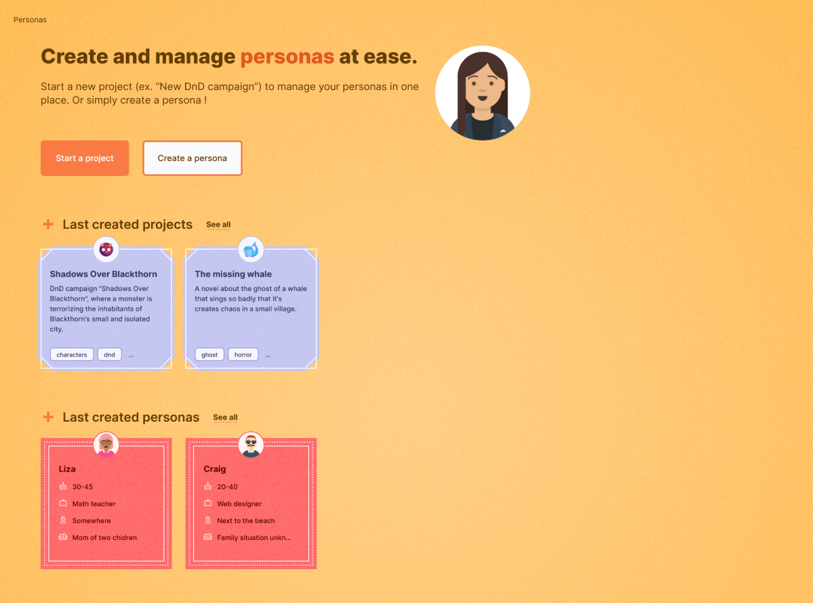
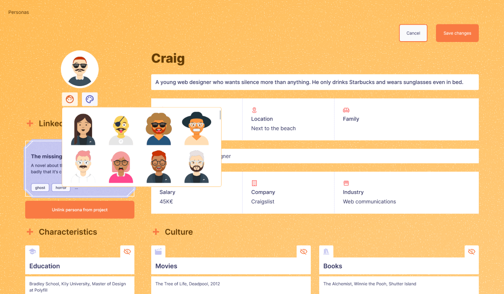
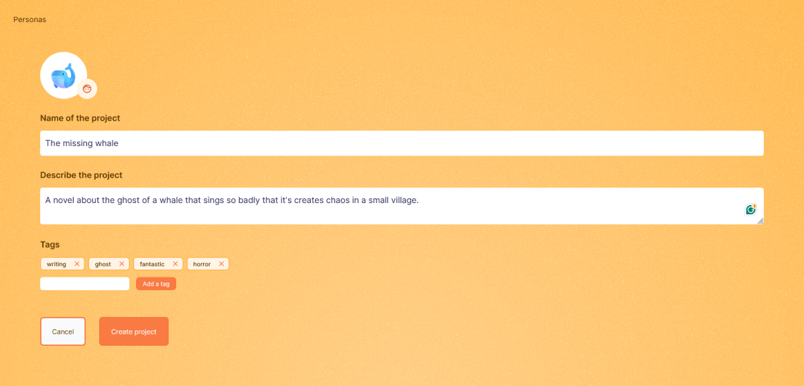
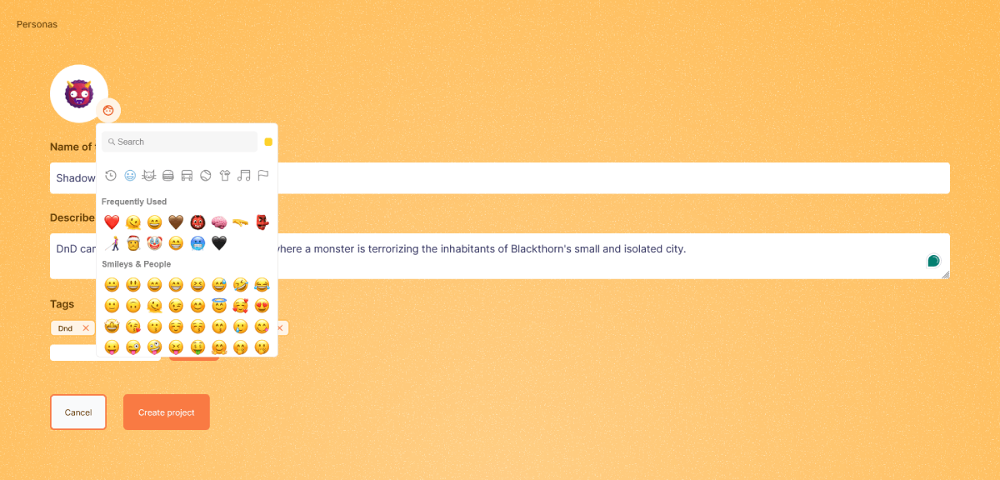

# PERSONAS

A web application for creating and managing personas.

Online demo : *TODO*

## :rocket: Goals of the project

## Goals FRONTEND

* Learn **Next.js**
* Explore **new design** (close to DnD)
* Try **shadcn/ui** components
* Have **fun**

## Goals BACKEND

* Create a **REST API**
* Explore **Spring Boot**
* Learn **API conventions**
* Go further with **Docker**
* Improve documentation with **OPENAPI**
* Be familiar with a **new API Client** (Bruno)
* Add **security**

## :dart: Presentation of the project

* **Personas** is a web application for creating and managing detailed personas.
* Create a **project** — such as your *new novel* or a *new DnD campaign* — where you can store multiple personas like main characters, villains, etc., all linked to your project.
* Additionally, you can create **standalone personas** and add them to a project later.
* The application has a design inspired by the look and feel of **D&D**.
* The back-end is built using **Spring Boot**.
* The front-end use **Next.js**.

## :white_check_mark: Todos

* [x] Add a Front-end (Next.js)
* [x] Add form components
* [x] Add basic security with Spring Security
* [x] Add design
* [x] Create/Update form server validation (with server actions)
* [x] Handle error requests (add a toaster whith shadcdn ui, add error page fallback)
* [x] Add 404 page
* [x] Add a custom component for creating tags (or use the one to update them)
* [x] Add `createdAt` on Project and Persona for filtering last items
* [x] Delete error message on input focus
* [x] Border on error input
* [x] Use tailwind-merge to improve CSS flexibility
* [x] Handle empty data (homepage, etc.)
* [x] Base Metadata
* [x] Responsive
* [x] Images, gifs
* [ ] Details metadata (dynamic metadata, opengraph)
* [ ] Basic client validation (required, with zod ?)
* [ ] Scroll to top on page change
* [ ] Skeleton loader
* [ ] Reset active tag
* [ ] Add interceptors
* [ ] Add an existing persona to a project
* [ ] Hide block info
* [ ] Add color palette for the persona
* [ ] Delete orphan tags on update project
* [ ] Authentication ?
  
## :iphone: Images










## 🏍 Run the project
1. Clone the repo
2. Install Docker
3. Inside the Spring Boot project :
```bash
# Launch docker
docker compose up -d

# Create files for mapping
.\mvnw clean install -DskipTests
```
4. Launch project
5. Import Bruno files (bruno/) to test the project with Bruno (API client)
6. Inside the Next.js project :
```bash
# Install packages
npm install

# Run development server and project
npm run dev
```

## :package: Packages

### Packages FRONTEND

* **TailwindCSS** for styling
* **emoji-picker-react** for handling emojis in form
* **Iconify** for easy-to-use icons
* **Sonner** for notifications
* **tailwind-merge** and **clsx** for *className* flexibility

### Packages BACKEND

* **Lombok** for less boilerplate
* **Mapstruct** for the mapping of entities
* **OPENAPI** for documentation

## :pushpin: Technologies

### Technologies FRONTEND

* Node 20.14.0
* Next.js 14.2.4

### Technologies BACKEND

* Spring Boot 3.2.2
* Java 17
* Docker version 25.0.3, build 4debf41
* Docker Desktop 4.27.2 (137060)
* Postgresql
* Bruno v1.8.0